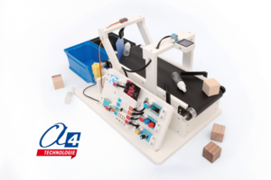

# BE-CONVO



MakeCode extension for the **A4 BE-CONVO AI Sorting Conveyor**.

This extension provides blocks to control the main elements of the BE-CONVO educational model from Microsoft MakeCode for **BBC micro:bit**:

* push buttons;
* potentiometer;
* conveyor motor;
* servomotor;
* OLED screen;
* RGB light ring;
* AI camera / AI-Lens.

The BE-CONVO is an educational programmable conveyor designed to introduce students to automation, sorting systems and embedded artificial intelligence. It can be used to sort objects or waste items using a **BBC micro:bit**, a Nezha interface and an AI camera.

## Product and resources

Product page:

https://www.a4.fr/robotique-et-programmation/maquettes-programmables-automatisees/convoyeur-de-tri-ia.html

Digital resources:

https://www.a4.fr/convoyeur-de-tri-ia-ressources.html

## Use this extension in MakeCode

This repository can be added as an extension in MakeCode for **BBC micro:bit**.

1. Open [Microsoft MakeCode for micro:bit](https://makecode.microbit.org/).
2. Create a new project.
3. Click **Extensions**.
4. Paste the repository URL:

```text
https://github.com/A4-TECHNOLOGIE/BE-CONVO
```

5. Select the **BE-CONVO** extension.

## Blocks

The extension adds a **BE-CONVO** block category to MakeCode.

The blocks are organized by function:

* **Push Buttons**: detect buttons A, B, C and D;
* **Potentiometer**: read the potentiometer value as a percentage;
* **Motor**: run, set the speed and stop the conveyor motor;
* **Servomotor**: set the angle of the sorting servomotor;
* **OLED Screen**: display text or numbers and clear the screen;
* **Light Ring**: turn the RGB light ring on or off and set its color;
* **AI Camera**: initialize the AI camera, detect colors and recognize learned objects.

## Basic usage

```blocks
a4_BE_CONVO.setMotorSpeed(50)
a4_BE_CONVO.setServoAngle(90)
a4_BE_CONVO.showUserText("BE-CONVO", 1)
a4_BE_CONVO.setRingColor(a4_BE_CONVO.Colors.Green)
```

## AI camera usage

The AI camera can be used for color recognition or object learning.

```blocks
a4_BE_CONVO.initModule()
a4_BE_CONVO.switchfunc(a4_BE_CONVO.FuncList.Color)

basic.forever(function () {
    a4_BE_CONVO.cameraImage()
    if (a4_BE_CONVO.colorCheck(a4_BE_CONVO.ColorLs.blue)) {
        a4_BE_CONVO.showUserText("Blue!", 1)
    } else if (a4_BE_CONVO.colorCheck(a4_BE_CONVO.ColorLs.green)) {
        a4_BE_CONVO.showUserText("Green!", 1)
    } else {
        a4_BE_CONVO.oledClear()
    }
})
```

## Example program

This example is based on the extension test program.

It demonstrates:

* starting the conveyor motor with button C;
* stopping the conveyor motor with button D;
* testing the RGB light ring with the BBC micro:bit logo;
* initializing the AI camera in color recognition mode;
* displaying detected colors on the OLED screen;
* controlling the servomotor angle with the potentiometer.

```blocks
a4_BE_CONVO.onButtonPressed(ButtonChoice.C, function () {
    a4_BE_CONVO.setMotorSpeed(100)
})

a4_BE_CONVO.onButtonPressed(ButtonChoice.D, function () {
    a4_BE_CONVO.stopMotor()
})

input.onLogoEvent(TouchButtonEvent.Pressed, function () {
    a4_BE_CONVO.setRingColor(a4_BE_CONVO.Colors.Green)
    basic.pause(200)
    a4_BE_CONVO.setRingColor(a4_BE_CONVO.Colors.Blue)
    basic.pause(200)
    a4_BE_CONVO.setRingColor(a4_BE_CONVO.Colors.Red)
    basic.pause(200)
    a4_BE_CONVO.setRingColor(a4_BE_CONVO.Colors.White)
    basic.pause(200)
    a4_BE_CONVO.setRingColor(a4_BE_CONVO.Colors.Black)
    basic.pause(200)
})

a4_BE_CONVO.initModule()
a4_BE_CONVO.switchfunc(a4_BE_CONVO.FuncList.Color)

basic.forever(function () {
    a4_BE_CONVO.cameraImage()

    if (a4_BE_CONVO.colorCheck(a4_BE_CONVO.ColorLs.blue)) {
        a4_BE_CONVO.showUserText("Blue!", 1)
    } else if (a4_BE_CONVO.colorCheck(a4_BE_CONVO.ColorLs.green)) {
        a4_BE_CONVO.showUserText("Green!", 1)
    } else {
        a4_BE_CONVO.oledClear()
    }

    a4_BE_CONVO.setServoAngle(Math.map(a4_BE_CONVO.potentiometerValue(), 0, 100, 40, 160))
})
```

## Educational use

The BE-CONVO model is designed for classroom activities about:

* automation;
* sensors and actuators;
* object sorting;
* recycling challenges;
* embedded artificial intelligence;
* machine learning through object or color recognition;
* block-based programming with MakeCode;
* introduction to Python programming.

## License

MIT

## Supported target

```text
microbit
```

## MakeCode metadata

```package
a4_BE_CONVO=github:A4-TECHNOLOGIE/BE-CONVO
```
